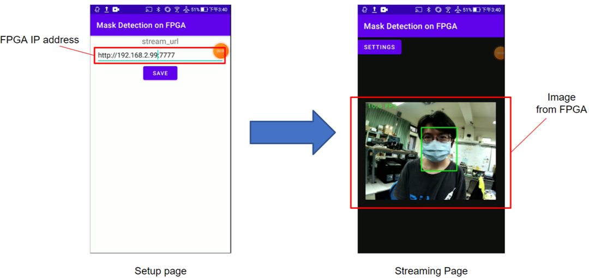
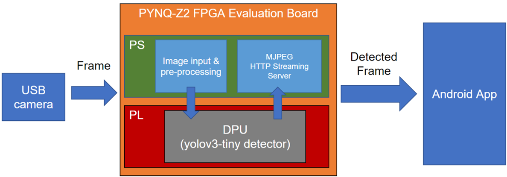

# PYNQ-Z2 Mask Detection Sreaming system
An AIoT project based on PYNQ-Z2 FPGA Evaluation board. Reading image from usb camera and running yolov3-tiny detection with DPU and using MJPEG HTTP Streaming. Also provide an Android app for handy accessing the streaming content.

## Used Repository
The detecting model is from [lp6m](https://github.com/lp6m) / [tiny_yolov3_face_mask_detect](https://github.com/lp6m/tiny_yolov3_face_mask_detect) this repository. The HTTP streaming plugin are using [thomasarmel](https://github.com/thomasarmel) / [MJPEGWriter](https://github.com/thomasarmel/MJPEGWriter) this repository. Many thanks to their contribution for the community.

## Android app demo:
Two main interface in app, It will be setting page in the begining and after entering FPGA IP address as streaming source then click save, the screen will transit to streaming page and start to recive the image data from PYNQ-Z2 if it's already running the main application. 



## System Architecture

Capture the image data from USB camera and perform detection tasks with DPU accelerate and encode the detected frame in MJPEG then write in streaming.

## Quick Start
1. Download the custom PYNQ-Z2 image from [here](https://drive.google.com/file/d/1Vmt0k3idkBbZIQvs4ZhaU1z1AxDdqWB7/view?usp=sharing). And flash into a SD card as a booting disk.(Minimum 16GB SD-card recommended) For the detail about board setup, please refer to the [official documentation](https://pynq.readthedocs.io/en/latest/getting_started/pynq_z2_setup.html).  

2. In the first time booting up the system, please run the following script with sudo authority. The password is ```xilinx```
    ```
    sudo /home/xilinx/jupyter_notebooks/resize_partition.sh
    ``` 
    This is for expanding the file system volume to the capacity of entire SD card.  
3. Upload the **pynq_z2** folder from this repository to your FPGA board. The detail file tree shown as below.
    ``` 
    ─pynq_z2
        └─mask_detection_MJPEG
            │  Mask_121.jpg
            │  youtube_320.mp4
            │  Makefile
            │  yolo
            │
            ├─src
            │      MJPEGWriter.h
            │      utils.h
            │      MJPEGWriter.cpp
            │      main.cc
            │
            ├─model
            │      dpu_mask_yolov3_tiny.elf
            │
    ```
4. In FPGA board's terminal, cd to the folder mask_detection_MJPEG and simply make the project.
    ```
    cd pynq_z2/mask_detection_MJPEG
    make
    ```
After finish, you'll see an excecutable file ***yolo*** under same directory, you can run the project according to following different mode.  
**Please notice that except MJPEG streaming mode, the program will render an GUI window for showing the detection result. Please make sure enabled the X11 forwarding in SSH connection.**  
    Test picture mode:
    ```
    yolo <path to image file> -i
    ``` 
    This mode the program will read the image which user specified and perform detection on it. Then showing the detection result and save it as result.jpg under the same directory. 
<!--slide:https://drive.google.com/file/d/13tejWLNMesSYHnvtSpyGJQ7GeOpSTJsX/view?usp=sharing-->
<!--A thing of beauty I know will never fade away.-->
